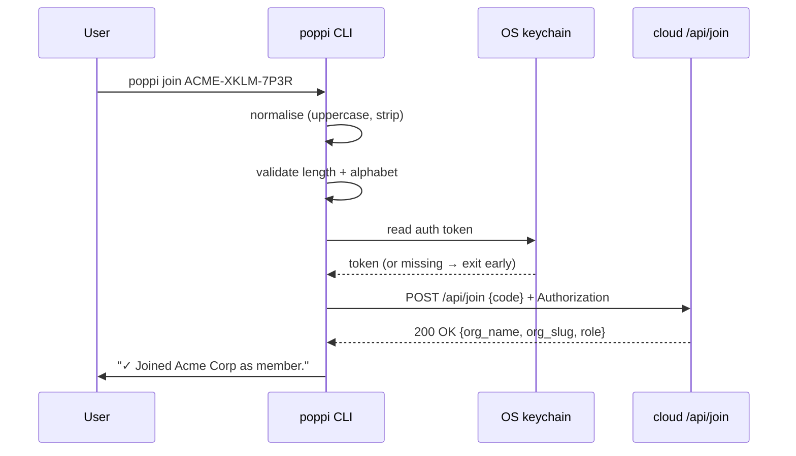

# Feature Specification: `poppi join` — CLI org invite-code redemption

**Feature Branch**: `004-cli-org-join`

**Created**: 2026-05-23

**Status**: Draft

**Input**: User description: "Add a `poppi join <code>` CLI subcommand that redeems an invite code (generated by an Org Admin on the cloud side) and adds the authenticated user to the Organization at the role baked into the code."

## Cross-repo context _(informational)_

This spec is the **client side** of the cloud feature [`poppi/specs/003-org-membership-permissions/spec.md`](../../../poppi/specs/003-org-membership-permissions/spec.md). That cloud spec introduces Organizations, Memberships, and **short invite codes** (base32-Crockford, ≥60 bits entropy, sha256-hashed at rest) as the v1 invitation mechanism — chosen over email-based invitations and URL-link invitations explicitly because it's the simplest credible MVP. Admins generate codes in the dashboard and share them through their existing channels (Slack, DM, verbally over a meeting); recipients redeem them through one of two surfaces:

1. **CLI** — `poppi join <code>` (this spec).
2. **Web** — a "Join with code" field on the dashboard (cloud-side, not in this spec).

Both surfaces hit one server endpoint: `POST /api/join` with body `{code: string}`. The endpoint normalises and hashes the input, looks up the Invitation, verifies it (not expired / not revoked / not exhausted), and atomically creates a Membership while incrementing `used_count`.

This CLI spec is intentionally narrow: it adds one subcommand (`join`) and the error-rendering / auth-recovery semantics around it. It does **not** introduce a `poppi org` namespace, does **not** add `org list` / `org leave` / `org current` commands, and does **not** modify `poppi upload`'s behavior for users without a Membership (the cloud server already returns the well-defined `org_required` error class on upload from a no-membership user; surfacing that explicitly across the CLI is a future spec).

## User Scenarios & Testing _(mandatory)_

### User Story 1 — Logged-in user redeems an invite code and joins an Organization (Priority: P1)

A developer has installed `poppi`, run `poppi login` previously, and has a valid auth token in their OS keychain. Their team's tech lead pastes an invite code into the team Slack: `ACME-XKLM-7P3R`. The developer runs `poppi join ACME-XKLM-7P3R`. The CLI normalises the code (uppercase, strip whitespace, ignore separators), POSTs `{code}` to the server, gets back a `200 OK` with the Organization's name + slug + role, and prints:

```
✓ Joined Acme Corp as member.
  You can now run `poppi upload` to send sessions to this organization.
```

It exits 0.

**Why this priority**: This is the only reason the subcommand exists. Without the happy path, every other story is moot.

**Independent Test**: With the cloud's local development stack running, an Admin generates an invite code via the dashboard. A second `poppi login`'d account, on a clean machine, runs `poppi join <code>` (passing the exact code string from the Admin). The command exits 0; a SQL query against the local Supabase confirms a `memberships` row for that user with the role baked into the code; the `invitations.used_count` is incremented by exactly 1.

**Acceptance Scenarios**:

1. **Given** an authenticated user (valid token in OS keychain) and a valid invite code from the cloud, **When** they run `poppi join <code>`, **Then** the CLI sends `POST /api/join` with the normalised code in the body and the auth token in the `Authorization` header, prints a single-line success message naming the Organization and role, and exits 0.
2. **Given** the same authenticated user runs `poppi join <code>` again with the same code, **When** they are already a member of that Organization, **Then** the CLI prints "You are already a member of `<Org>`." and exits 0 (idempotent — not an error).
3. **Given** a user passes the code in mixed case with extra whitespace and missing hyphens (`acme xklm7p3r`), **When** the CLI processes the input, **Then** the same normalised value is sent to the server and the join succeeds; the user never has to retype.
4. **Given** the server returns `200 OK` with the role in the response, **When** the CLI prints the success message, **Then** the role text matches the server-returned value exactly (no client-side reinterpretation).

---

### User Story 2 — Unauthenticated user attempts to redeem a code (Priority: P1)

A developer has just installed `poppi` (never run `poppi login`). They get an invite code from their team. They run `poppi join ACME-XKLM-7P3R`. The CLI detects there is no token in the OS keychain, prints a clear message ("You're not signed in. Run `poppi login` first, then re-run this command."), and exits with a documented non-zero exit code. The CLI does **not** prompt for login interactively in v1 — login is its own dedicated command with its own UX.

**Why this priority**: First-time users will hit this path. A confusing message here (or a silent failure) makes the entire onboarding flow feel broken even though every piece is working.

**Independent Test**: On a clean machine with no `poppi` token in the OS keychain, `poppi join ANY-VALID-CODE-FORMAT` exits with the documented non-zero exit code, prints the "not signed in" message on stderr, and makes zero network requests to the cloud (verified by running against a mock server that records all hits).

**Acceptance Scenarios**:

1. **Given** no token is stored in the OS keychain, **When** the user runs `poppi join <code>`, **Then** the CLI prints the "not signed in, run `poppi login` first" message and exits with the documented non-zero exit code; no network request is made.
2. **Given** a token exists in the keychain but the server returns `401 Unauthorized` (token expired / revoked from the website / corrupted), **When** the CLI receives the response, **Then** it prints "Your session has expired. Run `poppi login` and try again." and exits with the documented non-zero exit code; it does **not** silently retry, does **not** prompt for re-login mid-command, and does **not** fall back to any alternative endpoint.
3. **Given** the keychain itself is unavailable (headless Linux without `libsecret`, locked Mac keychain, etc.), **When** `poppi join` tries to read the token, **Then** the CLI prints the same error class as `poppi upload` produces in this scenario ("Secure token storage required") and exits with the documented non-zero exit code; the CLI never silently falls back to a plaintext file.

---

### User Story 3 — Typed error responses from the server render as actionable messages (Priority: P1)

The cloud `/api/join` endpoint returns a small, fixed set of typed error codes when redemption fails for a non-auth reason. The CLI MUST recognise each, render an actionable message naming the specific failure mode, and exit with the documented non-zero exit code. Errors include:

- `expired` — the code is past its expiry window. The CLI prints: "This invite code has expired. Ask the admin for a new one."
- `revoked` — the Admin revoked the code. The CLI prints: "This invite code has been revoked. Ask the admin for a new one."
- `exhausted` — the code's usage cap has been reached. The CLI prints: "This invite code has reached its usage limit. Ask the admin for a new one."
- `not_found` — the code does not exist (typo / wrong slug). The CLI prints: "Invite code not recognised. Check for typos or ask the admin to confirm the code." (No information about whether the code ever existed — same response shape as `expired` / `revoked` would expose.)
- `wrong_org` — the authenticated user is already a member of a different Organization (one-org-per-user v1). The CLI prints: "You are already a member of `<Other Org>`. Leave that organization on the dashboard before joining `<This Org>`."
- `rate_limited` — the redemption rate-limit (per-IP + per-user) was tripped. The CLI prints: "Too many join attempts. Try again in a few minutes." plus the `Retry-After` header value when present.

**Why this priority**: Without typed error rendering, users see opaque HTTP status codes. The cloud spec (SC-009) explicitly mandates that errors be machine-readable; this spec mandates that the CLI honours that contract.

**Independent Test**: For each of the six typed error responses, a contract-style test posts the corresponding response and asserts that the CLI prints the exact documented user-facing string, exits with the documented non-zero exit code, and makes no further network requests.

**Acceptance Scenarios**:

1. **Given** the server responds with HTTP 4xx and a body containing a documented `code` field matching one of the six typed errors, **When** the CLI receives the response, **Then** the printed message corresponds 1:1 to the documented user-facing string for that error code.
2. **Given** the server responds with HTTP 5xx (transient infrastructure failure), **When** the CLI receives the response, **Then** the CLI applies the same bounded retry policy `poppi upload` uses (`p-retry` with a small, documented retry budget for transient errors only), and on final failure prints a clear "couldn't reach the server, try again later" message.
3. **Given** the server returns HTTP 426 (`Upgrade Required` — the global version-gate behavior shared with `poppi upload`), **When** the CLI receives the response, **Then** it prints the upgrade message (current CLI version, required minimum version, upgrade command) and exits with the documented non-zero exit code without further retries. (The version-gate semantics are inherited from the existing `poppi upload` flow, not redefined here.)
4. **Given** the server responds with HTTP 200 but a body that does NOT match the documented success schema, **When** the CLI parses it via zod, **Then** the CLI surfaces a contract-violation error ("server responded with an unexpected shape") and exits with the documented non-zero exit code — no silent fallback to a partial success.

---

### Edge Cases

- **Code passed without quoting and contains shell-significant characters**: The CLI accepts the code as a single positional argument. Hyphens are safe in shells. If the user pastes a code without spaces, no shell-quoting is needed. Documentation includes one quoted example for clarity.
- **Code longer than the documented maximum length**: The CLI MUST reject locally (before any network call) with "Invite code is the wrong length — check for accidentally pasted extra characters" rather than asking the server to make this judgement. Saves a round-trip and protects the server's rate limit from typo storms.
- **Code containing characters outside the base32-Crockford alphabet (after normalisation)**: Same as above — reject locally with "Invite code contains unexpected characters."
- **Multiple positional arguments** (`poppi join CODE1 CODE2`): oclif's strict-args mode catches this; print the standard usage message and exit with the documented non-zero exit code.
- **No argument** (`poppi join` with no code): oclif's required-args validation prints the usage and exits with the documented non-zero exit code.
- **`--endpoint` flag pointing at a local stack**: Like `poppi upload --endpoint`, `poppi join` MUST accept an `--endpoint` flag (or equivalent env var, matching the existing convention) so contributors can join orgs in their local Docker stack without touching production. Server URL resolution is shared with the existing commands.
- **Network unreachable**: Bounded retry per `poppi upload`'s policy, then a clear "couldn't reach the server" message and the documented non-zero exit code; the CLI never partially-applies the join (the operation is atomic on the server side, so there's no partial state to recover).
- **User's clock is wildly skewed**: Doesn't affect this endpoint — code expiry is checked server-side using server time; no client-signed token here.
- **Code starts with `--`** (mistaken flag): oclif's positional-after-flags resolution handles this; the spec documents that users can use `--` as a separator (`poppi join -- --weird-code`) but the v1 code format doesn't generate codes starting with `--` so this is largely theoretical.

## Requirements _(mandatory)_

### Functional Requirements

#### Command surface

- **FR-001**: The CLI MUST expose a new top-level subcommand `poppi join <code>` where `<code>` is a required positional argument. (Spec'd as a top-level command rather than under a `poppi org` namespace because v1 introduces only a single org-related command; a namespace is explicit follow-up should multiple org commands land.)
- **FR-002**: The command MUST accept the cross-cutting `--endpoint` flag (or its env-var equivalent) so the CLI can be pointed at a non-production cloud (e.g., the local Docker stack) — same convention as the existing `poppi upload`.
- **FR-003**: The command MUST be discoverable through `poppi --help` and `poppi join --help`, both produced by oclif's standard help mechanism. The help text MUST name the code argument, show one example, and mention that the code is obtained from an Org Admin.
- **FR-004**: The command MUST exit with documented exit codes for each terminal state (success, auth required, validation error, typed redemption error, transient infra failure, contract violation). Exit codes are part of the public contract (FR-036 of `001-cli-ingest-client`).

#### Input handling

- **FR-005**: Before any network request, the CLI MUST normalise the code: uppercase, strip all whitespace, strip all characters outside the base32-Crockford alphabet (the documented separator characters, e.g. `-`, are stripped). The normalised code is what the CLI sends in the request body.
- **FR-006**: After normalisation, the CLI MUST validate the code's local well-formedness — length within the documented bounds, alphabet within base32-Crockford. Invalid codes MUST be rejected locally without a network request, with the exact error class documented in Edge Cases.
- **FR-007**: The CLI MUST NOT log the plaintext code at the default log level. Codes are sensitive material (they grant org access); the only log path that may include the code is an explicit `--debug` flag, and even then the docs warn that debug output may contain secrets.

#### Authentication

- **FR-008**: The CLI MUST read the auth token from the OS keychain via the existing `@napi-rs/keyring`-based mechanism `poppi login` populates. There is no command-line flag to pass a token directly (consistent with `poppi upload`).
- **FR-009**: If no token is present, the CLI MUST exit before making any network request, with the "not signed in" message and the documented non-zero exit code.
- **FR-010**: If the keychain itself is unavailable, the CLI MUST exit with the same error class `poppi upload` uses in this scenario (no plaintext fallback).
- **FR-011**: If the server responds 401, the CLI MUST exit with "Your session has expired. Run `poppi login` and try again." — no silent retries, no interactive re-prompt.

#### Network contract (consumer of `poppi/specs/003`)

- **FR-012**: The CLI MUST POST to the cloud's `/api/join` endpoint with `Content-Type: application/json` and body `{"code": "<normalised>"}`. The `Authorization` header carries the bearer token from the keychain.
- **FR-013**: The CLI MUST validate the response body against a zod schema for both the success (200) and error (4xx) shapes. Schema validation failures are surfaced as contract violations and exit with the documented non-zero exit code.
- **FR-014**: The CLI MUST apply the same bounded retry policy `poppi upload` uses for transient errors (`p-retry` configured per the existing project convention) — and only for transient errors (network reset, 5xx, 429 without `Retry-After`). All other 4xx errors (the typed redemption codes, 401, 426) fail fast.
- **FR-015**: When the server returns 429 `rate_limited`, the CLI MUST honour the `Retry-After` header in its user-facing message ("Too many join attempts. Try again in N seconds.") and exit with the documented non-zero exit code — it does NOT auto-retry on rate-limit (different from the bounded transient retry).
- **FR-016**: When the server returns 426 (version-gate), the CLI MUST render the upgrade message using its existing `semver`-based gate semantics, the same as `poppi upload`.

#### Output

- **FR-017**: On success, the CLI MUST print a single human-readable success line on stdout naming the Organization and the role joined, plus one suggested next-step line (e.g., "Run `poppi upload` to send sessions to this organization."). No JSON output mode in v1 — `poppi join` is a one-shot interactive command, not a pipeline step.
- **FR-018**: On error, the CLI MUST print the user-facing message on stderr; stdout MUST be empty on the failure path. This keeps `poppi join <code> && do-something` working correctly in shell scripts.
- **FR-019**: All CLI output MUST use the project's existing colorization convention (`picocolors`), respect `NO_COLOR` and `--no-color`, and not embed escape codes into stderr destined for a non-TTY.

#### Anonymization & redaction policy

- **FR-020**: This command does NOT process session data and therefore is OUT OF SCOPE for the anonymizer (Constitution Principle VI). The `redaction_policy_version` is irrelevant to `/api/join` requests and MUST NOT be included in the request body.

### Key Entities



No new persistent local entities. The command does NOT modify the upload ledger, the auth token, or any other persistent CLI state. The Membership the user joins is recorded server-side (see `poppi/specs/003-org-membership-permissions/data-model.md`); the CLI is a transient client.

## Success Criteria _(mandatory)_

### Measurable Outcomes

- **SC-001 (waste lever — per Constitution Principle I)**: A developer who has been handed an invite code by their tech lead can go from "code in clipboard" to "joined the org and authorised to upload" in under 30 seconds on a typical broadband connection, with at most one shell command (`poppi join <code>`). Measured against the local Docker stack as a scripted scenario.
- **SC-002 (no-auth fast-fail)**: 100% of attempts to run `poppi join` without a valid keychain token exit before any network request, verified by running the command against a mock server that records all hits and asserting zero hits in the no-auth case.
- **SC-003 (typed-error fidelity)**: 100% of the six documented typed error responses (`expired`, `revoked`, `exhausted`, `not_found`, `wrong_org`, `rate_limited`) produce the exact documented user-facing message, verified by an automated test that posts each canned response and asserts on stderr.
- **SC-004 (idempotency)**: Re-running `poppi join <code>` while already a member of the target Organization exits 0 and prints "already a member" — verified by an automated test that joins, then re-joins, and asserts the exit code and stderr/stdout shape on the second call.
- **SC-005 (no plaintext leakage)**: Default-level CLI logs MUST NOT contain the plaintext code. Verified by an automated test that runs the command with the standard log level and asserts the captured stderr/stdout does not contain the code value.
- **SC-006 (contract-violation safety)**: When the cloud server responds with an unexpected shape, the CLI exits non-zero rather than silently degrading — verified by a zod-schema test that injects malformed success/error bodies and asserts on the failure path.

## Assumptions

- **The cloud `/api/join` endpoint is the authoritative source of all redemption logic.** Code validity, expiry, revocation, usage-cap, role assignment, and one-org-per-user enforcement are server-side concerns. The CLI is a thin transport.
- **No new dependencies.** All required libraries (`@oclif/core`, `zod`, `p-retry`, `@napi-rs/keyring`, `picocolors`, the existing http client used by `poppi upload`) are already in `package.json` from spec `001-cli-ingest-client`.
- **Auth uses the existing token store.** `poppi login` is the only command that writes the auth token; `poppi join` only reads it. No changes to login UX.
- **No interactive prompting in v1.** `poppi join <code>` is a one-shot command. If we later want a `poppi join` (no args) that interactively prompts for the code, that's explicit follow-up — keeping v1 minimal and scriptable.
- **No `poppi org` namespace in v1.** Should multiple org-related commands land (`org list`, `org leave`, `org current`), a future spec MAY introduce the namespace and re-home `join` underneath it. Until then, `poppi join` is a top-level command. A migration alias (`poppi join` → `poppi org join`) is straightforward in oclif and is explicit follow-up.
- **The Organization's role enum is `owner | admin | member`** — matching the cloud's spec. The CLI prints the role verbatim from the server response and does NOT enumerate roles locally.
- **`--debug` may include the plaintext code.** Existing CLI convention. Documentation warns that debug output should not be shared in issue reports without redaction.

## Out of Scope (for this spec)

- A `poppi org` namespace and related subcommands (`org list`, `org leave`, `org current`, `org transfer`) — explicit follow-up.
- Self-service Org creation from the CLI (`poppi org create`) — v1 Org creation happens on the web dashboard during first-login onboarding (see cloud spec).
- Interactive prompt for the code when `poppi join` is invoked with no argument.
- A `--json` output mode for the join command. Adoption is one-shot interactive; if a scripted use case emerges later, add it as a follow-up.
- Auto-recovery on expired auth tokens (silent re-login). The CLI hard-fails and asks the user to run `poppi login`.
- Any URL-link wrapping of invite codes (e.g., accepting `https://poppi.app/join/<code>` as a CLI argument).
- Changes to `poppi upload`'s behavior when the user has no Membership. The cloud server already returns a typed error class for that case; surfacing it across all CLI commands is an explicit follow-up spec.
