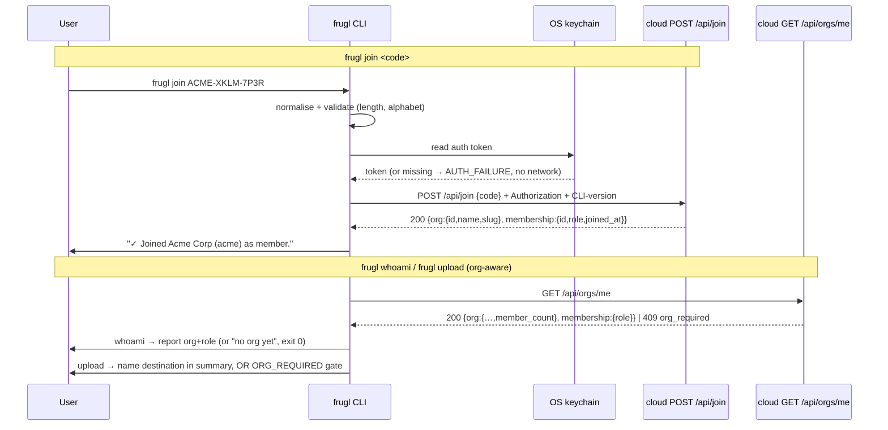

# Feature Specification: frugl-cli org membership — `frugl join` + org-aware `whoami` / `upload`

**Feature Branch**: `004-cli-org-join`

**Created**: 2026-05-23

**Updated**: 2026-05-24

**Status**: Draft

**Input**: User description: "Add a `frugl join <code>` CLI subcommand that redeems an invite code (generated by an Org Admin on the cloud side) and adds the authenticated user to the Organization at the role baked into the code." — expanded (2026-05-24) to also make the existing commands org-aware: `frugl whoami` reports the caller's Organization and role, and `frugl upload` cleanly surfaces the "no organization yet" onboarding gate and names the destination Organization in its pre-upload summary.

## Cross-repo context _(informational)_

This spec is the **client side** of the cloud feature [`frugl/specs/003-org-membership-permissions/spec.md`](../../../frugl/specs/003-org-membership-permissions/spec.md). That cloud spec introduces Organizations, Memberships, and **short invite codes** (base32-Crockford, ≥48 bits entropy on the user-typed portion, sha256-hashed at rest) as the v1 invitation mechanism — chosen over email-based and URL-link invitations explicitly because it's the simplest credible MVP. Admins generate codes in the dashboard and share them through their existing channels (Slack, DM, verbally over a meeting); recipients redeem them through one of two surfaces:

1. **CLI** — `frugl join <code>` (this spec).
2. **Web** — a "Join with code" field on the dashboard (cloud-side, not in this spec).

The cloud spec also reframes onboarding around the Organization: a first-time user **creates** an Organization on the web dashboard during first-login (cloud `POST /api/orgs/create`, US1 of spec 003), and from then on every Upload, SessionObject, and Parsed Artifact is scoped to that Organization. The server derives the `org_id` from the authenticated user's single Membership and the caller MUST NOT override it (cloud FR-023/FR-024) — so the CLI never sends an `org_id`; it only needs to know **which** Organization it is about to upload into, and to fail cleanly when the user has no Membership yet.

The two cloud endpoints this spec consumes (beyond the auth + upload endpoints already consumed by `001-cli-ingest-client`):

- **`POST /api/join`** — redeem an invite code. Body `{ "code": string }`. Success `200` returns `{ org: { id, name, slug }, membership: { id, role, joined_at } }`. Typed errors: `400 validation_failed`, `401 unauthorized`, `404 not_found`, `409 already_member`, `409 wrong_org`, `410 expired|revoked|exhausted`, `426 upgrade_required`, `429 rate_limited` (with `Retry-After`), `500 internal`.
- **`GET /api/orgs/me`** — return the caller's current Organization and Membership. Success `200` returns `{ org: { id, name, slug, member_count, created_at }, membership: { role, joined_at } }`. Returns `409 org_required` when the caller has no Membership; `401 unauthorized` with no session.

This spec is intentionally bounded: it adds **one** new subcommand (`join`) and makes **two** existing commands (`whoami`, `upload`) org-aware. It does **not** introduce a `frugl org` namespace, does **not** add `org list` / `org leave` / `org transfer` commands, and does **not** add CLI-side Organization creation (`frugl org create`) — v1 founder onboarding happens on the web dashboard (cloud spec 003 US1). Those are explicit follow-ups (see Out of Scope).

## User Scenarios & Testing _(mandatory)_

### User Story 1 — Logged-in user redeems an invite code and joins an Organization (Priority: P1)

A developer has installed `frugl`, run `frugl login` previously, and has a valid auth token in their OS keychain. Their team's tech lead pastes an invite code into the team Slack: `ACME-XKLM-7P3R`. The developer runs `frugl join ACME-XKLM-7P3R`. The CLI normalises the code (uppercase, strip whitespace, ignore separators), POSTs `{code}` to the server, gets back a `200 OK` with the Organization's name + slug and the granted role, and prints:

```
✓ Joined Acme Corp (acme) as member.
  You can now run `frugl upload` to send sessions to this organization.
```

It exits 0.

**Why this priority**: This is the only reason the subcommand exists. Without the happy path, every other story is moot.

**Independent Test**: With the cloud's local development stack running, an Admin generates an invite code via the dashboard. A second `frugl login`'d account, on a clean machine, runs `frugl join <code>` (passing the exact code string from the Admin). The command exits 0; a SQL query against the local Supabase confirms a `memberships` row for that user with the role baked into the code; the `invitations.used_count` is incremented by exactly 1.

**Acceptance Scenarios**:

1. **Given** an authenticated user (valid token in OS keychain) and a valid invite code from the cloud, **When** they run `frugl join <code>`, **Then** the CLI sends `POST /api/join` with the normalised code in the body and the bearer token in the `Authorization` header, prints a single success message naming the Organization (name + slug) and the granted role, and exits 0.
2. **Given** a user passes the code in mixed case with extra whitespace and missing hyphens (`acme xklm7p3r`), **When** the CLI processes the input, **Then** the same normalised value is sent to the server and the join succeeds; the user never has to retype.
3. **Given** the server returns `200 OK` with the role in the response, **When** the CLI prints the success message, **Then** the role text matches the server-returned `membership.role` value exactly (no client-side reinterpretation).
4. **Given** the same authenticated user runs `frugl join <code>` again for an Organization they already belong to, **When** the server responds `409 already_member`, **Then** the CLI prints "You are already a member of `<Org>`." and exits **0** — the CLI treats the already-member conflict as an idempotent no-op success even though the wire status is 409 (see FR-017).

---

### User Story 2 — Unauthenticated / expired / keychain-blocked redemption (Priority: P1)

A developer has just installed `frugl` (never run `frugl login`). They get an invite code from their team. They run `frugl join ACME-XKLM-7P3R`. The CLI detects there is no token in the OS keychain, prints a clear message ("You're not signed in. Run `frugl login` first, then re-run this command."), and exits with a documented non-zero exit code. The CLI does **not** prompt for login interactively in v1 — login is its own dedicated command with its own UX.

**Why this priority**: First-time users will hit this path. A confusing message here (or a silent failure) makes the entire onboarding flow feel broken even though every piece is working.

**Independent Test**: On a clean machine with no `frugl` token in the OS keychain, `frugl join ANY-VALID-CODE-FORMAT` exits with the documented non-zero exit code, prints the "not signed in" message on stderr, and makes zero network requests to the cloud (verified by running against a mock server that records all hits).

**Acceptance Scenarios**:

1. **Given** no token is stored in the OS keychain, **When** the user runs `frugl join <code>`, **Then** the CLI prints the "not signed in, run `frugl login` first" message and exits `AUTH_FAILURE`; no network request is made.
2. **Given** a token exists in the keychain but the server returns `401 unauthorized` (token expired / revoked from the website / corrupted), **When** the CLI receives the response, **Then** it prints "Your session has expired. Run `frugl login` and try again." and exits `AUTH_FAILURE`; it does **not** silently retry, does **not** prompt for re-login mid-command, and does **not** fall back to any alternative endpoint.
3. **Given** the keychain itself is unavailable (headless Linux without `libsecret`, locked Mac keychain, etc.), **When** `frugl join` tries to read the token, **Then** the CLI prints the same error class as `frugl upload` produces in this scenario ("Secure token storage required") and exits `KEYCHAIN_UNAVAILABLE`; the CLI never silently falls back to a plaintext file.

---

### User Story 3 — Typed redemption errors render as actionable messages (Priority: P1)

The cloud `/api/join` endpoint returns a small, fixed set of typed error codes when redemption fails for a non-auth reason. The CLI MUST recognise each, render an actionable message naming the specific failure mode, and exit with the documented exit code:

- `not_found` (404) — the code does not exist (typo / never issued). CLI prints: "Invite code not recognised. Check for typos or ask the admin to confirm the code." Exits `JOIN_CODE_REJECTED`.
- `expired` (410) — the code is past its expiry window. CLI prints: "This invite code has expired. Ask the admin for a new one." Exits `JOIN_CODE_REJECTED`.
- `revoked` (410) — the Admin revoked the code. CLI prints: "This invite code has been revoked. Ask the admin for a new one." Exits `JOIN_CODE_REJECTED`.
- `exhausted` (410) — the code's usage cap has been reached. CLI prints: "This invite code has reached its usage limit. Ask the admin for a new one." Exits `JOIN_CODE_REJECTED`.
- `wrong_org` (409) — the authenticated user is already a member of a _different_ Organization (one-org-per-user v1). CLI prints: "You are already a member of `<details.current_org_name>`. Leave that organization on the dashboard before joining `<details.target_org_name>`." Exits `ALREADY_IN_OTHER_ORG`.
- `rate_limited` (429) — the per-origin redemption rate-limit was tripped. CLI prints: "Too many join attempts. Try again in `<Retry-After>` seconds." Exits `RATE_LIMITED`.

**Why this priority**: Without typed error rendering, users see opaque HTTP status codes. The cloud spec (SC-009) makes redemption errors machine-readable; this spec makes the CLI honour that contract with one human-actionable message per failure mode.

**Independent Test**: For each typed error response, a contract-style test posts the corresponding canned response and asserts that the CLI prints the documented user-facing string, exits with the documented exit code, and makes no further network requests. The `wrong_org` test asserts that `details.current_org_name` and `details.target_org_name` are interpolated into the message verbatim.

**Acceptance Scenarios**:

1. **Given** the server responds with a documented 4xx `error` code, **When** the CLI receives the response, **Then** the printed message corresponds 1:1 to the documented user-facing string for that error code, and the exit code matches the mapping above.
2. **Given** the `wrong_org` response carries `details.current_org_name` and `details.target_org_name`, **When** the CLI renders the message, **Then** both names are interpolated from the response body — the CLI does not hard-code or guess them.
3. **Given** the server responds with HTTP 5xx (transient infrastructure failure), **When** the CLI receives the response, **Then** the CLI applies the same bounded retry policy `frugl upload` uses (transient errors only, ~3 attempts), and on final failure exits `NETWORK_FAILURE` with a clear "couldn't reach the server, try again later" message.
4. **Given** the server returns `426 upgrade_required` (the global version-gate behaviour shared with `frugl upload`), **When** the CLI receives the response, **Then** it prints the upgrade message (current CLI version, required minimum, upgrade command) and exits `VERSION_GATE_FAILURE` without further retries.
5. **Given** the server responds `200 OK` (or a 4xx) with a body that does NOT match the documented schema, **When** the CLI validates it, **Then** the CLI surfaces a contract-violation error ("server responded with an unexpected shape") and exits `GENERIC_FAILURE` — no silent fallback to a partial success.

---

### User Story 4 — `frugl whoami` reports my Organization and role (Priority: P1)

A developer who has logged in and joined an Organization runs `frugl whoami` to confirm where their next upload will land and what they can see. The CLI reports their authenticated identity (as today) **plus** the Organization they belong to and their role:

```
Signed in as dev@acme.com
Organization: Acme Corp (acme) — 7 members
Your role: member
```

A developer who has logged in but **not yet joined or created an Organization** runs `frugl whoami` and is told clearly that they have no Organization yet, with the two ways to get one:

```
Signed in as dev@acme.com
Not a member of any organization yet.
  Run `frugl join <code>` with an invite from your org admin,
  or create an organization at https://frugl.app.
```

Both cases exit 0 — being authenticated is the success condition for `whoami`; having no Organization yet is a reported state, not a failure.

**Why this priority**: With Organizations now scoping all data, "which org am I about to upload to, and what's my role" is the single most common pre-upload question. Without org context in `whoami`, the only way to answer it is the web dashboard — which defeats the CLI-first workflow.

**Independent Test**: Against the local stack, a logged-in account that belongs to an Organization runs `frugl whoami`; the output names the Organization (matching `GET /api/orgs/me`) and the role, and exits 0. A second logged-in account with no Membership runs `frugl whoami`; the output reports "no organization yet" with the join/create guidance and exits 0. A logged-out invocation exits `AUTH_FAILURE` as before.

**Acceptance Scenarios**:

1. **Given** an authenticated user who belongs to an Organization, **When** they run `frugl whoami`, **Then** the CLI reports the authenticated email/identity, the Organization name and slug, the member count, and the caller's role — sourced from `GET /api/orgs/me` — and exits 0.
2. **Given** an authenticated user with no Membership, **When** they run `frugl whoami` and `GET /api/orgs/me` returns `409 org_required`, **Then** the CLI reports the identity, states that no Organization exists yet, names both ways to get one (`frugl join <code>` and creating one on the dashboard), and exits 0.
3. **Given** no valid session, **When** the user runs `frugl whoami`, **Then** the CLI prints the existing "not logged in" message and exits `AUTH_FAILURE` (unchanged from `001-cli-ingest-client`).
4. **Given** `--json` is passed, **When** `frugl whoami` runs, **Then** the single JSON object on stdout includes the identity fields and an `organization` field that is either the org object (`id`, `name`, `slug`, `member_count`, `role`) or `null` when the user has no Membership.

---

### User Story 5 — `frugl upload` before joining an Organization shows a clear onboarding gate (Priority: P1)

A developer logs in and immediately runs `frugl upload`, but has not yet joined or created an Organization. Rather than discovering sessions, anonymizing them, and only failing at the first cloud write with an opaque error, the CLI resolves the caller's Organization up front, detects there is none, and stops before doing any work:

```
You haven't joined an organization yet, so there's nowhere to upload to.
  Run `frugl join <code>` with an invite from your org admin,
  or create an organization at https://frugl.app, then re-run `frugl upload`.

No sessions were discovered, anonymized, or transmitted.
```

It exits with a documented non-zero exit code (`ORG_REQUIRED`).

**Why this priority**: This is the very first thing a brand-new CLI user does after login. The cloud returns `409 org_required` on the upload path for a no-Membership user; if the CLI surfaces that as a generic failure (or only after a slow discover + anonymize pass), the onboarding experience feels broken. Catching it early, before any local work, with the exact next steps, is the difference between "this tool is broken" and "oh, I need to join my team's org first."

**Independent Test**: Against the local stack, a logged-in account with no Membership runs `frugl upload`. The CLI makes no presign or manifest-create call, performs no anonymization, transmits zero bytes, prints the onboarding-gate message naming both remedies, and exits `ORG_REQUIRED`. A mock-server run asserts that no upload endpoint was hit.

**Acceptance Scenarios**:

1. **Given** an authenticated user with no Membership, **When** they run `frugl upload`, **Then** the CLI resolves org context via `GET /api/orgs/me`, receives `409 org_required`, prints the onboarding-gate message (naming both `frugl join <code>` and dashboard creation), transmits zero bytes, and exits `ORG_REQUIRED`.
2. **Given** the org-context resolution happens before discovery/anonymization, **When** the gate fires, **Then** no session files are read for anonymization and no inspection directory is written — the gate short-circuits the pipeline at the earliest point.
3. **Given** a user passes `--dry-run`, **When** they have no Membership, **Then** the same `ORG_REQUIRED` gate fires (a dry run still needs to know the destination Organization to produce an honest summary); the CLI does not silently produce a dry-run as if an Organization existed.
4. **Given** the user's Membership is revoked by an Admin _mid-upload_ (after org context resolved but before the batch completes), **When** a subsequent cloud call returns `401`/`403`, **Then** the CLI exits `AUTH_FAILURE`, preserves local resume state (per `001` FR-026/FR-029c), and instructs the user to check their access and re-run — it does not leave a half-written batch it cannot describe.

---

### User Story 6 — `frugl upload` names the destination Organization in its pre-upload summary (Priority: P2)

A developer who belongs to an Organization runs `frugl upload`. Before any bytes leave the machine, the pre-upload confirmation summary (mandated by `001-cli-ingest-client` FR-020) now names the destination Organization alongside the existing session count / size / redaction-policy line, so the user can confirm they are uploading into the right place:

```
Uploading to: Acme Corp (acme) — your role: member
Discovered 52 sessions: 47 unchanged (skipping), 3 new, 2 updated. Will upload 5 sessions, ~22 MB redacted.
Redaction policy: v3. Destination: https://frugl.app
Proceed? [y/N]
```

**Why this priority**: With one Organization per user in v1, mis-targeting is rare — but the moment multi-org or org-switching arrives, an unnamed destination becomes a real data-spill risk. Naming the Organization now sets the habit and the contract; it is a small, high-value addition rather than a launch blocker.

**Independent Test**: Against the local stack, a logged-in member of an Organization runs `frugl upload` (without `--confirm`); the rendered summary contains a line naming the Organization (name + slug) and the caller's role, sourced from the same `GET /api/orgs/me` call used by the gate. Under `--json`, the `upload-start` event carries the org id and slug.

**Acceptance Scenarios**:

1. **Given** an authenticated member of an Organization, **When** the pre-upload summary is rendered, **Then** it includes a line naming the destination Organization (name + slug) and the caller's role, in addition to the existing FR-020 fields.
2. **Given** `--confirm` / `--yes` is passed (non-interactive), **When** the upload proceeds without a prompt, **Then** the destination Organization is still emitted on stderr (text mode) or in the `upload-start` event (`--json` mode), so automation logs record where the batch went.
3. **Given** `--json` mode, **When** the `upload-start` NDJSON event is emitted, **Then** it carries an additive `organization` object (`id`, `slug`) — the addition is backward-compatible with the `001` event contract (FR-039), which permits strictly-additive fields.

---

### Edge Cases

- **Code passed without quoting**: The CLI accepts the code as a single positional argument. Hyphens are shell-safe; a pasted code without spaces needs no quoting. Docs include one quoted example for clarity.
- **Code longer than the documented maximum length**: The CLI MUST reject locally (before any network call) with "Invite code is the wrong length — check for accidentally pasted extra characters," saving a round-trip and sparing the server's redemption rate-limit from typo storms.
- **Code with characters outside base32-Crockford (after normalisation)**: Rejected locally with "Invite code contains unexpected characters." Exits `USAGE`.
- **Multiple positional arguments** (`frugl join CODE1 CODE2`): caught by strict-args validation; prints usage and exits `USAGE`.
- **No argument** (`frugl join`): required-arg validation prints usage and exits `USAGE`. (No interactive prompt in v1.)
- **`--endpoint` flag pointing at a local stack**: Like `frugl upload --endpoint`, `frugl join` and the org-context resolution in `frugl upload`/`frugl whoami` MUST honour `--endpoint` (and `FRUGL_ENDPOINT`) so contributors can exercise org flows against their local Docker stack.
- **`400 validation_failed` from `/api/join`**: The server rejected the code shape even though local validation passed (e.g., the documented format drifted). The CLI surfaces the server's message and exits `USAGE`; it does not retry.
- **Network unreachable**: Bounded retry per `frugl upload`'s policy, then "couldn't reach the server" and `NETWORK_FAILURE` (or `ENDPOINT_UNREACHABLE` for an explicit unreachable `--endpoint`). The join is atomic server-side, so there is no partial client state to repair.
- **User's clock is skewed**: Does not affect redemption — code expiry is checked against server time; there is no client-signed token.
- **`GET /api/orgs/me` returns `409 org_required` during `whoami`**: Treated as the "no org yet" _reported state_, exit 0 — not an error (see US4 scenario 2). Only `frugl upload` treats `org_required` as a hard gate (`ORG_REQUIRED` exit) because upload cannot proceed without a destination.
- **`GET /api/orgs/me` returns `426`**: The version-gate fires identically to every other cloud call — upgrade message, `VERSION_GATE_FAILURE`, no retry.
- **`GET /api/orgs/me` transiently 5xx during `upload`**: Bounded retry per the shared policy; on exhaustion the CLI exits `NETWORK_FAILURE` _before_ anonymizing or transmitting — it never proceeds to upload with an unknown destination.
- **Already a member of the target org, redeeming its code again** (`409 already_member`): friendly "already a member" message, exit 0 (idempotent — US1 scenario 4).
- **Already a member of a _different_ org** (`409 wrong_org`): the one-org-per-user conflict; message names the current and target orgs from `details`, exits `ALREADY_IN_OTHER_ORG` (US3).

## Requirements _(mandatory)_

### Functional Requirements

#### `frugl join` — command surface

- **FR-001**: The CLI MUST expose a new top-level subcommand `frugl join <code>` where `<code>` is a required positional argument. (Top-level rather than under a `frugl org` namespace because v1 introduces only a single redemption command; a namespace is explicit follow-up.)
- **FR-002**: `frugl join` MUST honour the cross-cutting `--endpoint` flag and `FRUGL_ENDPOINT` environment variable (flag wins), matching `frugl upload`'s endpoint-resolution convention (`001` FR-030/FR-031).
- **FR-003**: `frugl join` MUST be discoverable through `frugl --help` and `frugl join --help`. The help text MUST name the `<code>` argument, show one example, and state that the code is obtained from an Org Admin.

#### `frugl join` — input handling

- **FR-004**: Before any network request, the CLI MUST normalise the code: uppercase, strip whitespace, strip separator/non-Crockford characters. The normalised value is what is sent in the request body. (Server normalisation is authoritative per cloud `join.md`; client normalisation rejects locally-malformed input early.)
- **FR-005**: After normalisation, the CLI MUST validate local well-formedness — length within documented bounds and alphabet within base32-Crockford. Invalid codes MUST be rejected locally (no network request) and exit `USAGE`.
- **FR-006**: The CLI MUST NOT log the plaintext code at the default log level (codes grant org access). Only an explicit `--debug` path may include it, and the docs MUST warn that debug output can contain secrets.

#### Authentication (shared by `join`, `whoami`, `upload`)

- **FR-007**: The CLI MUST read the auth token from the OS keychain via the existing mechanism `frugl login` populates. There is no flag to pass a token directly (consistent with `frugl upload`).
- **FR-008**: If no token is present, `frugl join` MUST exit `AUTH_FAILURE` before any network request, with the "not signed in, run `frugl login` first" message.
- **FR-009**: If the keychain is unavailable, the CLI MUST exit `KEYCHAIN_UNAVAILABLE` with the same error class `frugl upload` uses — never a plaintext fallback.
- **FR-010**: If any consumed endpoint responds `401 unauthorized`, the CLI MUST exit `AUTH_FAILURE` with "Your session has expired. Run `frugl login` and try again." — no silent retries, no interactive re-prompt, no alternative-endpoint fallback.

#### `frugl join` — network contract (consumer of cloud `POST /api/join`)

- **FR-011**: The CLI MUST `POST` to the cloud's `/api/join` endpoint with `Content-Type: application/json`, body `{"code": "<normalised>"}`, and the bearer token in the `Authorization` header. It MUST send the CLI-version header (`001` FR-032) so the version gate applies.
- **FR-012**: The CLI MUST validate both the success (`200`) and typed-error response bodies against a schema. The success shape is `{ org: { id, name, slug }, membership: { id, role, joined_at } }`. Schema-validation failures are contract violations and exit `GENERIC_FAILURE` (US3 scenario 5).
- **FR-013**: The CLI MUST apply the shared bounded-retry policy (`001` FR-029a) for transient failures only — network reset, request timeout, HTTP 5xx. All typed 4xx redemption errors, `401`, `426`, and `429` fail fast (no transient-retry).
- **FR-014**: On `429 rate_limited`, the CLI MUST render "Too many join attempts. Try again in N seconds." using the `Retry-After` header value when present, and exit `RATE_LIMITED`. It MUST NOT auto-retry on rate-limit.
- **FR-015**: On `426 upgrade_required`, the CLI MUST render the upgrade message using the existing version-gate semantics (`001` FR-033) and exit `VERSION_GATE_FAILURE` without retry.
- **FR-016**: On the typed redemption-rejection errors `404 not_found`, `410 expired`, `410 revoked`, and `410 exhausted`, the CLI MUST render the corresponding documented message (US3) and exit `JOIN_CODE_REJECTED`.
- **FR-017**: On `409 already_member`, the CLI MUST print "You are already a member of `<Org>`." and exit **0** — the already-member conflict is an idempotent no-op success from the user's perspective, even though the wire status is 409.
- **FR-018**: On `409 wrong_org`, the CLI MUST render "You are already a member of `<details.current_org_name>`. Leave that organization on the dashboard before joining `<details.target_org_name>`." (names interpolated from the response `details`) and exit `ALREADY_IN_OTHER_ORG`.

#### `frugl join` — output

- **FR-019**: On success, the CLI MUST print a human-readable success line on stdout naming the Organization (name + slug) and the granted role, plus one suggested next-step line (e.g., "Run `frugl upload` to send sessions to this organization."). The role text MUST match `membership.role` verbatim.
- **FR-020**: On any error path, the CLI MUST print the user-facing message on stderr and keep stdout empty, so `frugl join <code> && …` chains correctly in scripts.
- **FR-021**: `frugl join` MUST support `--json`, emitting a single structured JSON object on stdout for the result (success: org + membership; error: typed `error` code + message), reserving stderr for diagnostics — matching the uniform machine-readable contract `001` FR-040 establishes for `login`/`logout`/`whoami`, so the eventual MCP wrapper parses every command identically.
- **FR-022**: All CLI output MUST follow the project's existing colour conventions (respect `NO_COLOR` / `--no-color`; no escape codes into a non-TTY).
- **FR-023**: `frugl join` does NOT process session data and is therefore outside the anonymizer's scope; `redaction_policy_version` is irrelevant to `/api/join` and MUST NOT appear in the request body.

#### `frugl whoami` — org awareness (consumer of cloud `GET /api/orgs/me`)

- **FR-024**: `frugl whoami` MUST, in addition to reporting the authenticated identity (`001` FR-003), call `GET /api/orgs/me` and report the caller's Organization (name + slug + member_count) and role on success (`200`).
- **FR-025**: When `GET /api/orgs/me` returns `409 org_required`, `frugl whoami` MUST report the identity, state that no Organization exists yet, name both remedies (`frugl join <code>` and creating one on the dashboard), and exit **0** — the no-org state is a reported state, not a `whoami` failure.
- **FR-026**: Under `--json`, `frugl whoami` MUST include an `organization` field that is either the org object (`id`, `name`, `slug`, `member_count`, `role`) or `null` when the caller has no Membership — extending the FR-040 result object additively.

#### `frugl upload` — org awareness (onboarding gate + destination)

- **FR-027**: `frugl upload` MUST resolve the caller's Organization via `GET /api/orgs/me` **before** anonymizing or transmitting anything. The CLI does NOT send an `org_id` on any upload request — the cloud derives it from the caller's Membership (cloud FR-023) — but the CLI MUST know the destination Organization to gate the run and to name it in the summary.
- **FR-028**: When org resolution returns `409 org_required`, `frugl upload` MUST abort with the onboarding-gate message (naming both `frugl join <code>` and dashboard creation), perform no discovery/anonymization, transmit zero bytes, write no inspection directory, and exit `ORG_REQUIRED`. This gate MUST fire for `--dry-run` invocations too (a dry run needs a real destination to be honest).
- **FR-029**: The `frugl upload` pre-upload confirmation summary (`001` FR-020) MUST include a line naming the destination Organization (name + slug) and the caller's role. Under `--confirm` / `--yes`, the destination MUST still be emitted (stderr in text mode; `upload-start` event in `--json` mode) so non-interactive runs record where the batch went.
- **FR-030**: Under `--json`, the `upload-start` NDJSON event (`001` FR-039) MUST carry an additive `organization` object (`id`, `slug`). The addition MUST be strictly additive — no existing field is renamed or removed — preserving the `001` event contract.
- **FR-031**: If a cloud call returns `401`/`403` _after_ org resolution but before batch completion (e.g., the Membership was revoked mid-upload), `frugl upload` MUST exit `AUTH_FAILURE`, preserve local resume state (`001` FR-026/FR-029c), and instruct the user to verify access and re-run. It MUST NOT silently downgrade to a partial success.

#### Exit codes (additions to the FR-037 contract)

- **FR-032**: This feature adds the following stable, grep-able exit codes to the `001-cli-ingest-client` exit-code contract (`contracts/exit-codes.md`, FR-036/FR-037). They claim next-available numbers within the reserved gaps; existing codes are never reassigned:
  - `ORG_REQUIRED` (proposed `12`, auth/identity range) — authenticated but no Organization Membership; emitted by `frugl upload` (FR-028). `whoami` does NOT use this code (it reports the no-org state and exits 0).
  - `JOIN_CODE_REJECTED` (proposed `70`) — invite code is not redeemable: `not_found` / `expired` / `revoked` / `exhausted` (FR-016). The specific sub-reason is conveyed in the message and, under `--json`, the `error` field.
  - `ALREADY_IN_OTHER_ORG` (proposed `71`) — one-org-per-user conflict; the caller belongs to a different Organization (`wrong_org`, FR-018).
  - `RATE_LIMITED` (proposed `72`) — redemption rate-limit tripped (`429`, FR-014).
- **FR-033**: All exit codes used by this feature — both the additions above and the reused `001` codes (`OK`, `USAGE`, `AUTH_FAILURE`, `KEYCHAIN_UNAVAILABLE`, `NETWORK_FAILURE`, `ENDPOINT_UNREACHABLE`, `VERSION_GATE_FAILURE`, `GENERIC_FAILURE`) — are part of the public contract (`001` FR-036) and MUST NOT shift between releases without a coordinated cross-repo bump.

### Key Entities



- **Organization (cloud-owned)**: The top-level data container introduced by cloud spec 003. The CLI never creates or mutates it; it only reads the caller's current Organization (`GET /api/orgs/me`) and joins one by redeeming a code (`POST /api/join`). Identified to the user by `name` + `slug`.
- **Membership / role (cloud-owned)**: The caller's `owner | admin | member` role within their Organization. The CLI prints the server-returned role verbatim and never enumerates or reinterprets roles locally.
- **Invite code**: Transient redemption material supplied by the user as the `frugl join` argument. Normalised and validated locally, then sent once; never persisted locally, never logged at the default level.
- **Org context (CLI-side, ephemeral)**: The `{ name, slug, role, member_count }` resolved from `GET /api/orgs/me` for the duration of a single `whoami` or `upload` invocation. NOT persisted — re-resolved each run, so a role change or org change on the server is reflected on the next invocation. The CLI adds **no** new persistent local state (no change to the auth token store, the upload ledger, or the resume state).

## Success Criteria _(mandatory)_

### Measurable Outcomes

- **SC-001 (join time-to-value)**: A developer handed an invite code goes from "code in clipboard" to "joined the org and authorised to upload" in under 30 seconds with one shell command (`frugl join <code>`), measured against the local Docker stack as a scripted scenario.
- **SC-002 (no-auth fast-fail)**: 100% of `frugl join` attempts without a valid keychain token exit before any network request — verified against a mock server that records hits and asserts zero hits in the no-auth case.
- **SC-003 (typed-error fidelity)**: 100% of the documented typed `/api/join` errors (`not_found`, `expired`, `revoked`, `exhausted`, `wrong_org`, `rate_limited`) produce the documented user-facing message and the documented exit code — verified by automated tests posting each canned response.
- **SC-004 (already-member idempotency)**: Re-running `frugl join <code>` for an Organization the caller already belongs to exits 0 with the "already a member" message — verified by a test that joins, then re-joins, asserting exit code and output shape on the second call.
- **SC-005 (no plaintext-code leakage)**: Default-level CLI output never contains the plaintext code — verified by a test that runs the command at the standard log level and asserts the captured stdout/stderr does not contain the code value.
- **SC-006 (contract-violation safety)**: When the cloud responds with an unexpected shape on any consumed endpoint (`/api/join`, `/api/orgs/me`), the CLI exits non-zero rather than silently degrading — verified by schema tests injecting malformed bodies.
- **SC-007 (whoami org clarity)**: For a member of an Organization, `frugl whoami` names the Organization and role matching `GET /api/orgs/me`; for a logged-in user with no Membership, it reports the no-org state with both remedies and exits 0 — verified by two scripted scenarios against the local stack.
- **SC-008 (upload gate honesty)**: A logged-in user with no Membership who runs `frugl upload` (with or without `--dry-run`) gets the `ORG_REQUIRED` gate with zero bytes transmitted, zero anonymization performed, and no upload endpoint hit — verified against a mock server asserting zero upload-endpoint hits and against the local stack asserting the exit code.
- **SC-009 (destination named before send)**: For a member of an Organization, the `frugl upload` pre-upload summary names the destination Organization (name + slug) before any confirmation or byte transmission, and the `--json` `upload-start` event carries the org id + slug — verified by a summary-snapshot test and a JSON-event test.

## Assumptions

- **The cloud is the authority for all org/membership logic.** Code validity, expiry, revocation, usage caps, role assignment, one-org-per-user enforcement, and `org_id` tagging of uploads are all server-side. The CLI is a thin client that reads org context and redeems codes; it never sets `org_id` on an upload (cloud FR-023).
- **One Organization per user in v1.** The CLI assumes `GET /api/orgs/me` returns at most one Organization and that `frugl upload` has exactly one possible destination. Org selection / switching becomes a CLI concern only when the cloud lifts one-org-per-user (cloud spec 003 Assumptions). At that point a `--org` flag or `frugl org use` is the natural follow-up.
- **Org creation is web-only in v1.** A brand-new founder creates their Organization on the dashboard (cloud spec 003 US1). The CLI surfaces "create one at the dashboard" as guidance but does not call `POST /api/orgs/create`. CLI-side org creation is explicit follow-up.
- **No new dependencies.** The libraries needed (CLI framework, schema validation, bounded retry, keychain access, colour) are already locked by `001-cli-ingest-client`. `GET /api/orgs/me` and `POST /api/join` reuse the existing HTTP client, version-gate, and retry plumbing.
- **Auth uses the existing token store.** `frugl login` remains the only writer of the auth token; `join`, `whoami`, and `upload` only read it. No change to login UX.
- **No new persistent local state.** `frugl join` and org-aware `whoami`/`upload` add nothing to the keychain, the upload ledger, or the resume state. Org context is re-resolved every run so server-side role/org changes take effect on the next invocation (no stale cache).
- **`--json` is the uniform machine contract.** `frugl join` gains `--json` and `whoami` extends its JSON result with org context, consistent with `001` FR-040's goal of a single parsing contract across the CLI surface for the eventual MCP wrapper.
- **The role enum is `owner | admin | member`**, matching the cloud spec; the CLI prints it verbatim.
- **`--debug` may include the plaintext code.** Existing CLI convention; docs warn debug output should be redacted before sharing.

## Out of Scope (for this spec)

- A `frugl org` namespace and related subcommands (`org list`, `org leave`, `org current`, `org transfer`, `org members`) — explicit follow-up.
- **CLI-side Organization creation** (`frugl org create` calling `POST /api/orgs/create`) — v1 founder onboarding is web-only (cloud spec 003 US1). A terminal-only bootstrap flow is explicit follow-up.
- Reading org analytics from the CLI (`GET /api/orgs/[id]/aggregates/overview`) — the Overview waste-lever surface is the dashboard's job; a `frugl report`/`frugl stats` command is a separate future spec.
- Member management from the CLI (invite-code creation, role changes, removals) — Admin actions live on the dashboard (cloud spec 003 US2/US4).
- Multi-org selection / switching and a `--org` flag — blocked on the cloud lifting one-org-per-user.
- Interactive prompt for the code when `frugl join` is invoked with no argument.
- Auto-recovery on expired auth tokens (silent re-login) — the CLI hard-fails and asks the user to run `frugl login`.
- URL-link wrapping of invite codes (accepting `https://frugl.app/join/<code>` as the argument).
- Leaving an Organization from the CLI (`frugl org leave`) — dashboard-only in v1 (cloud spec 003 US6).
